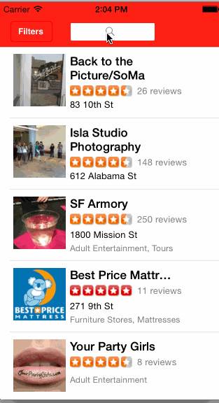

YelpAppDemo
===============
Time Spent :- 16hr

Supported Features
===============

Search results page

  1. Table rows should be dynamic height according to the content height

  2. Custom cells should have the proper Auto Layout constraints

  3. Search bar should be in the navigation bar (doesn't have to expand to show location like the real Yelp app does).
  
Filter page
  1. The filters you should actually have are: category, sort (best match, distance, highest rated), radius (meters), deals (on/off).
  
  2.The filters table should be organized into sections as in the mock.

  3. Clicking on the "Search" button should dismiss the filters page and trigger the search w/ the new filter settings.

Walkthrough of all user stories:

